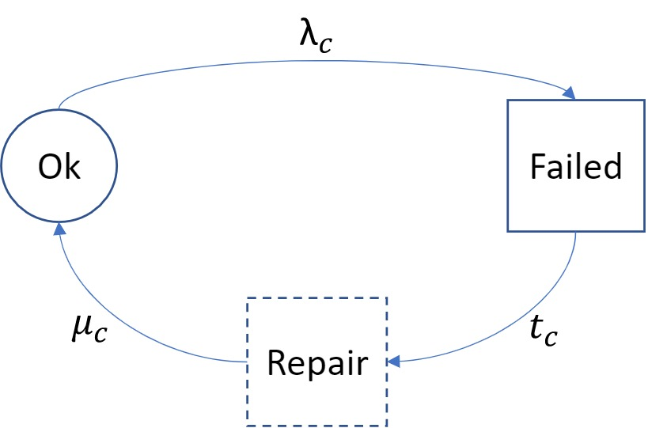

===================
Markov models
===================

A Markov model is a stochastic model used to describe the random change of systems. The system can change between different states that are not dependent on past states where all the possible states and the probability and rate of transition between the different states are described in the model. 

In relsad, Markov models are used as a basis for constructing the states of the power system components. A simple three-state model as seen in Figure REF is used. The three different states are the working state when the component is up and running, a failed state where the component is down and not working, and a repair state where the component still is failed but under repair. The repair state is activated when the failed component is located and a repair 
procedure chosen. 

The transition between the working state (OK) and the failed state is decided by the probability of a component being failed which is based on the failure rate of the component. The transition between the failed state and the repair state is based on the time it takes for a failure on a component to be discovered and the right repair procedure to be chosen. The transition between the repair state and the working state is determined by the repair time of the component. Some components, such as the ICT components, follow a multi-phase recovery where one repair procedure is tried first, if that does not work a new repair procedure will be executed, and so on. 

Some network components have multiple different failures that can occur. One example is the controller which can experience a hardware failure or a software failure. 

   
   Simple Markov model of the system components. :math:`\lambda_{c}` is the failure rate of component *c*, :math:`\mu_{c}` is the repair rate of component *c*, and :math:`t_{c}` is the time from component failure until the component is under repair. 