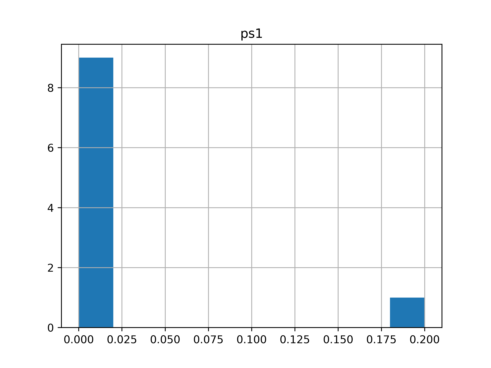

.. _tutorial_traditional_power_system_monte_carlo:

.....................................
Traditional power system, Monte Carlo
.....................................

Here we present how to run a small Monte Carlo
simulation of the behavior of the network presented in the
:ref:`system setup <tutorial_traditional_power_system_setup>`
section to illustrate how `RELSAD` can be used.

""""""""""""""""""""""
Monte Carlo simulation
""""""""""""""""""""""

To run a Monte Carlo simulation the user must specify:

* The number of iterations, `iterations`
* Simulation start time, `start_time`
* Simulation stop time, `stop_time`
* Time step, `time_step`
* Time unit presented in results, `time_unit`
* A callback function, `callback`
* List of Monte Carlo iterations to save, `save_iterations`
* Saving directory for results, `save_dir`
* Number of processes, `n_procs`
  
.. literalinclude:: ../../../../../relsad/examples/tutorial/monte_carlo.py
   :language: python
   :lines: 5-30

The callback argument allows the user to specify events on an incremental basis.
It is useful of you want to investigate how a given set of events impact the
system reliability for varying repair time etc.

The results from the simulation are found in the specified `save_dir`.
They include system reliability indices as well as bus information.

Here we plot `ENS` (Energy Not Supplied) for the power system:

.. literalinclude:: ../../../../../relsad/examples/tutorial/monte_carlo.py
   :language: python
   :lines: 32-48
    
The plot should look like this:

   
   ENS
