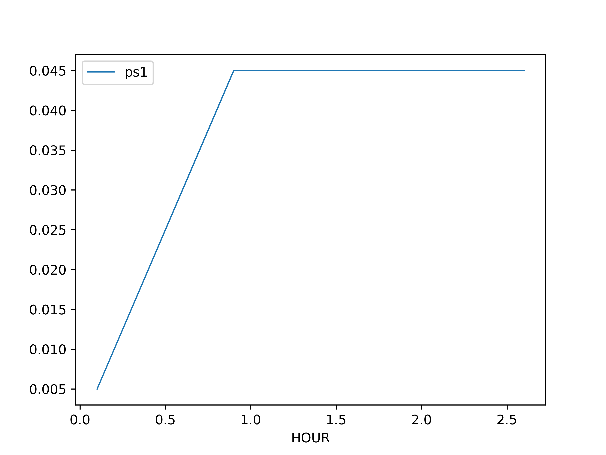

.. _tutorial_traditional_power_system_sequential:

....................................
Traditional power system, Sequential
....................................

Here we present the creation of a small example network in `RELSAD`.
The network consists of 6 buses and 6 lines,
where one of the lines is a backup line. We introduce simplified
loads and run a small sequential simulation of the behavior of the
network to illustrate how `RELSAD` can be used.

.. include:: system.rst

"""""""""""""""""""""
Sequential simulation
"""""""""""""""""""""

Finally, to run a sequential simulation the user must specify:

* Simulation start time, `start_time`
* Simulation stop time, `stop_time`
* Time step, `time_step`
* Time unit presented in results, `time_unit`
* A callback function, `callback`
* Saving directory for results, `save_dir`
  
::

    def callback(ps, prev_time, curr_time):
        dt = curr_time - prev_time
        if curr_time < dt:
            ps.get_comp("L2").fail(dt=dt)
            ps.get_comp("L6").fail(dt=dt)
        elif Time(1.95, unit=dt.unit) < curr_time < Time(2.05, unit=dt.unit):
            ps.get_comp("L3").fail(dt=dt)
    
    
    sim = Simulation(power_system=ps, random_seed=0)
    sim.run_sequential(
        start_time=TimeStamp(
            year=2019,
            month=0,
            day=0,
            hour=0,
            minute=0,
            second=0,
        ),
        stop_time=TimeStamp(
            year=2019,
            month=0,
            day=0,
            hour=10,
            minute=0,
            second=0,
        ),
        time_step=Time(0.1, TimeUnit.HOUR),
        time_unit=TimeUnit.HOUR,
        callback=callback,
        save_dir="results",
    )

Here we used the callback function to specify that line `L2` and
`L6` will fail at the start of the simulation, while line `L3` will fail
after two hours. The callback function enables easy customization
and implementation of scenarios of interest.

To run a deterministic sequential simulation the user must set
all failure rates to zero and all repair times to constant values.
Otherwise, the simulation will exhibit a stochastic behavior.

Here we plot `ENS` (Energy Not Supplied) for the power system::

    path = os.path.join(
        "results",
        "sequence",
        "ps1",
        "ENS.csv",
    )
    
    df = pd.read_csv(path)
    fig, ax = plt.subplots()
    df.plot(
        x="HOUR",
        y="ps1",
        ax=ax,
    )
    
    fig.savefig(
        "ENS.png",
        dpi=600,
    )
    
    print(df.describe())
    
The plot should look like this:

   
   ENS
